<p align="center">
  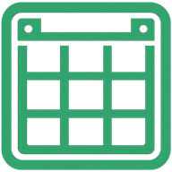
</p>

<h1 align="center">PrepTrack</h1>

<p align="center">
  <strong>Your supplies. Always in sight.</strong><br>
  <sub>Dein Vorrat. Immer im Blick.</sub>
</p>

<p align="center">
  <a href="https://beko2210.github.io/Prepper_Log/"></a>
</p>

<p align="center">
  <a href="https://github.com/BEKO2210/Prepper_Log/actions/workflows/deploy.yml"></a>
  <a href="https://github.com/BEKO2210/Prepper_Log/releases"></a>
  <a href="https://github.com/BEKO2210/Prepper_Log/blob/main/LICENSE"></a>
  <a href="https://github.com/BEKO2210/Prepper_Log/stargazers"></a>
  <a href="https://github.com/BEKO2210/Prepper_Log/issues"></a>
  <a href="https://github.com/BEKO2210/Prepper_Log/network/members"></a>
</p>

<p align="center">
  <a href="#-features">Features</a>&nbsp;&bull;
  <a href="#-screenshots">Screenshots</a>&nbsp;&bull;
  <a href="#-tech-stack">Tech Stack</a>&nbsp;&bull;
  <a href="#-getting-started">Getting Started</a>&nbsp;&bull;
  <a href="#-contributing">Contributing</a>&nbsp;&bull;
  <a href="#-license">License</a>
</p>

<p align="center">
  <a href="#-deutsch">🇩🇪 Deutsche Version weiter unten</a>
</p>

---

## What is PrepTrack?

PrepTrack is a **free, ad-free, offline-first Progressive Web App** for managing your emergency supplies, pantry, and stockpile. Scan barcodes, track expiry dates, receive local notifications — all data stays on your device. No cloud. No accounts. No tracking.

> **Built for preppers, self-sufficiency enthusiasts, and anyone who wants to keep their supplies organized.**

---

## ✨ Features

| Feature | Description |
|---------|-------------|
| **Barcode Scanner** | Scan barcodes with your camera. Auto-lookup via Open Food Facts API. Duplicate detection. |
| **Product Management** | Name, category, location, quantity, unit, expiry date (day/month/year precision), photo, notes. |
| **Expiry Tracking** | Color-coded warnings: Red (expired/critical), Orange (warning), Yellow (soon), Green (OK). |
| **Dashboard** | StatRing visualization, expiry distribution bar, urgent products, category overview, low stock counter. |
| **Local Notifications** | Push reminders 30, 14, 7, 3, and 1 day before expiry. No external servers. |
| **Storage Locations** | Create and manage custom locations. 8 defaults included. |
| **Consumption Log** | Mark products as consumed, expired, or damaged. View statistics. |
| **Data Export** | JSON backup (complete) and CSV export (Excel/Google Sheets compatible with proper encoding). |
| **Data Import** | Restore from backup with automatic duplicate detection. |
| **Offline-First** | Fully functional offline. All data in IndexedDB. Service Worker caches assets, fonts, and API responses. |
| **Installable PWA** | Install as native app on Android, iOS, and Desktop. |
| **Dark & Light Mode** | Dark theme by default. Toggle to light theme anytime. |
| **Multi-Language** | German (default), English, Portuguese, and Arabic. Language switcher with country flags in settings. |

---

## 📱 Screenshots

<details>
<summary><strong>🌙 Dark Mode</strong></summary>
<br>
<p align="center">
  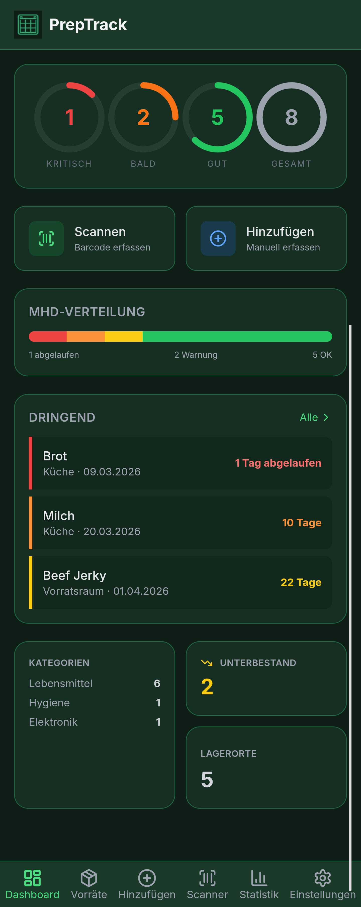
  &nbsp;
  
  &nbsp;
  
</p>
<p align="center">
  
  &nbsp;
  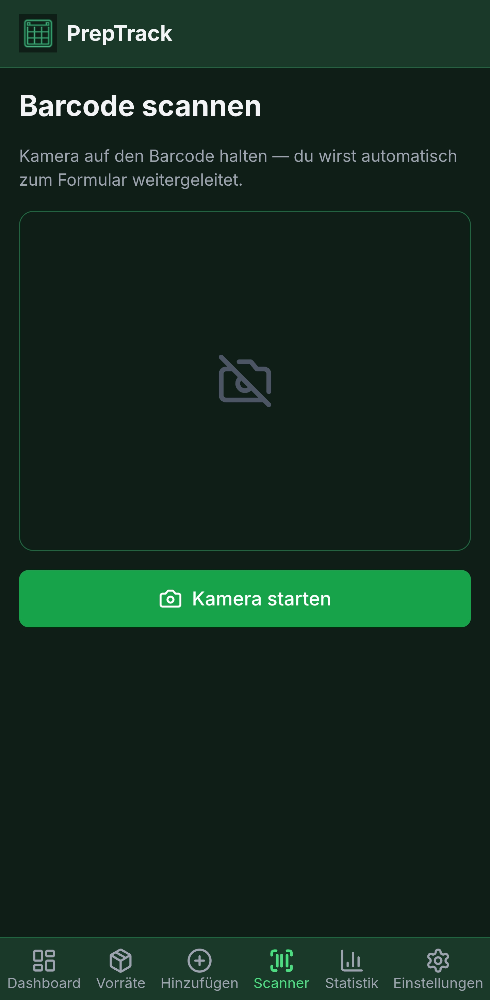
  &nbsp;
  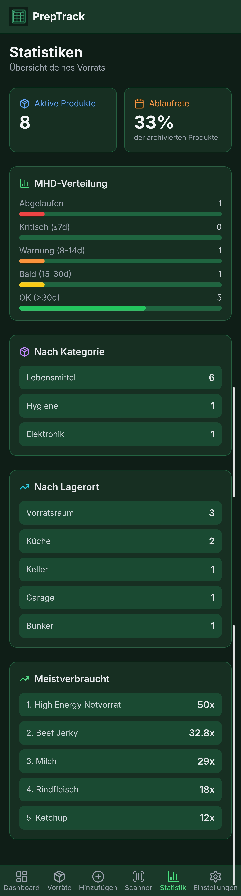
</p>
</details>

<details open>
<summary><strong>☀️ Light Mode</strong></summary>
<br>
<p align="center">
  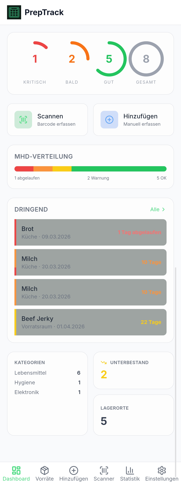
  &nbsp;
  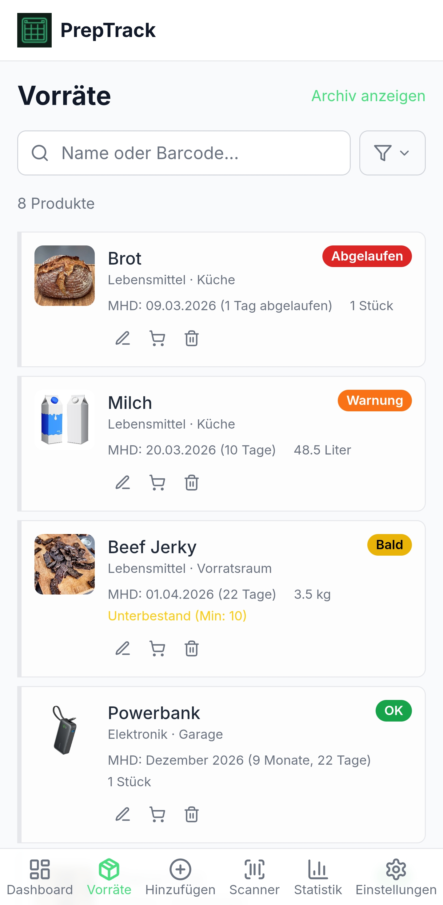
  &nbsp;
  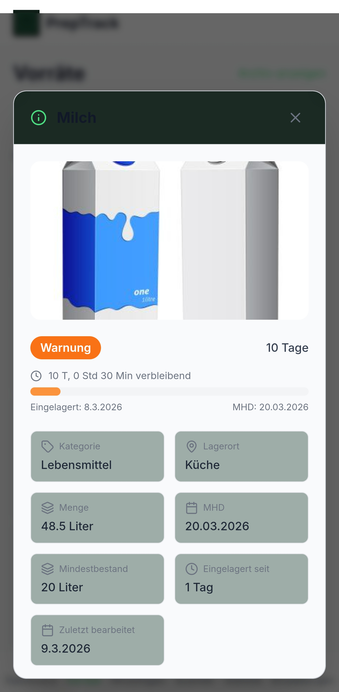
</p>
<p align="center">
  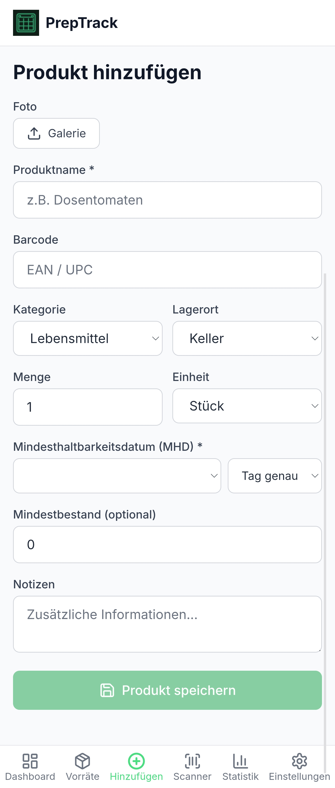
  &nbsp;
  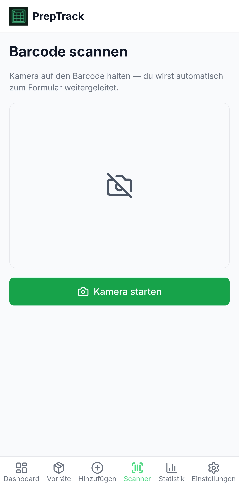
  &nbsp;
  
</p>
</details>

<details>
<summary><strong>🌐 Language Switcher (Multi-Language)</strong></summary>
<br>
<p align="center">
  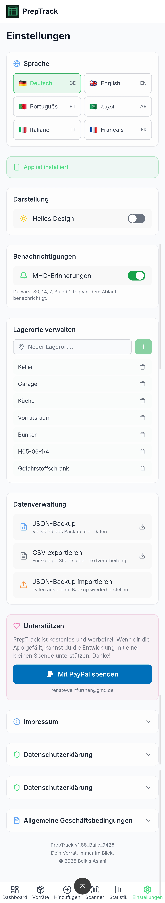
  &nbsp;
  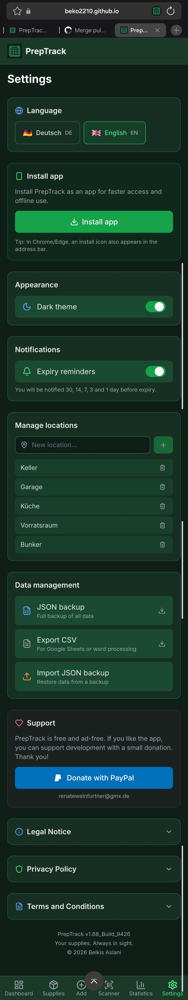
</p>
</details>

---

## 🛠 Tech Stack

| Category | Technology | Purpose |
|----------|-----------|---------|
| **Framework** | React 18 + TypeScript | Interactive SPA with type safety |
| **Bundler** | Vite 6 | Fast dev server, optimized builds |
| **Styling** | Tailwind CSS 3 | Utility-first, dark mode support |
| **State** | Zustand | Lightweight, no boilerplate |
| **Database** | Dexie.js (IndexedDB) | Offline-first, reactive queries |
| **PWA** | vite-plugin-pwa (Workbox) | Auto-update, runtime caching |
| **Scanner** | @zxing/browser | Barcode/EAN recognition via camera |
| **i18n** | react-i18next | Multi-language support (DE/EN/PT/AR) |
| **Icons** | Lucide React | Consistent, lightweight SVG icons |
| **Animation** | Framer Motion | Smooth UI transitions |
| **API** | Open Food Facts | Free product database |
| **CI/CD** | GitHub Actions | Auto-deploy to GitHub Pages |
| **Testing** | Vitest | Unit tests (59 tests) |

---

## 🚀 Getting Started

### Prerequisites

- [Node.js](https://nodejs.org/) 20.x or higher
- npm 9+

### Installation

```bash
# Clone the repository
git clone https://github.com/BEKO2210/Prepper_Log.git
cd Prepper_Log

# Install dependencies
npm install

# Start development server
npm run dev
```

The app is available at `http://localhost:5173`.

### Build & Test

```bash
npm run build      # Production build (tsc + vite)
npm run preview    # Preview production build locally
npm run test       # Run all tests (Vitest)
npx tsc --noEmit   # Type check without building
```

### Deploy (GitHub Pages)

1. Push to your GitHub repository
2. Go to **Settings > Pages** and set source to **GitHub Actions**
3. Every push to `main` triggers automatic deployment

---

## 📲 PWA Installation

<table>
<tr>
<td width="33%">

**Android (Chrome)**
1. Open app in browser
2. Tap "Install" banner or Menu > "Install app"

</td>
<td width="33%">

**iOS (Safari)**
1. Open app in browser
2. Tap Share button
3. Select "Add to Home Screen"

</td>
<td width="33%">

**Desktop (Chrome/Edge)**
1. Open app in browser
2. Click install icon in the address bar

</td>
</tr>
</table>

---

## 🔒 Privacy

PrepTrack takes your privacy seriously:

- **All data stored locally** on your device (IndexedDB). No cloud. No servers. No accounts.
- **No tracking.** No analytics. No cookies. No ads. No data shared with third parties.
- **External service:** Only the Open Food Facts API is contacted during barcode scans (open-source, non-profit). Only the barcode is transmitted.
- **Notifications** are generated locally. No push tokens sent to external servers.
- **Full control:** Export/import your data anytime. Delete via browser settings.

---

## 📂 Project Structure

```
src/
├── components/           UI Components
│   ├── Dashboard.tsx         Main overview with stats
│   ├── ProductList.tsx       Product list with filters
│   ├── ProductForm.tsx       Add/edit form with draft persistence
│   ├── BarcodeScanner.tsx    Camera barcode scanner
│   ├── Settings.tsx          Settings, language, export/import, legal
│   ├── Statistics.tsx        Consumption statistics
│   ├── Navigation.tsx        Bottom navigation bar
│   ├── StatRing.tsx          SVG ring chart component
│   ├── OfflineBanner.tsx     Offline indicator
│   ├── PWAInstallPrompt.tsx  PWA install prompt
│   └── ErrorBoundary.tsx     Error fallback UI
├── hooks/                Custom React Hooks
│   ├── useDarkMode.ts        Dark/light mode toggle
│   ├── useOnlineStatus.ts    Online/offline detection
│   └── usePWAInstall.ts      PWA installation
├── i18n/                 Internationalization
│   ├── i18n.ts               i18next configuration
│   └── locales/              Translation files (de, en, pt, ar)
├── lib/                  Business Logic
│   ├── db.ts                 Dexie.js database, CRUD, export/import
│   ├── utils.ts              Expiry calculation, formatting, barcode lookup
│   ├── utils.test.ts         Unit tests (59 tests)
│   └── notifications.ts      Local notifications
├── store/                State Management
│   └── useAppStore.ts        Zustand store (navigation, filters, state)
├── types/                TypeScript Types
│   └── index.ts              Product, Category, Units, etc.
├── App.tsx               Main component with routing
├── main.tsx              Entry point
└── sw-handler.ts         Service Worker update handler
```

---

## 🤝 Contributing

Contributions are welcome! Please read the [Contributing Guide](CONTRIBUTING.md) before submitting a pull request.

1. Fork the repository
2. Create your feature branch (`git checkout -b feature/amazing-feature`)
3. Commit your changes (`git commit -m 'Add amazing feature'`)
4. Push to the branch (`git push origin feature/amazing-feature`)
5. Open a Pull Request

See [open issues](https://github.com/BEKO2210/Prepper_Log/issues) for planned features and known bugs.

---

## 🛡 Security

If you discover a security vulnerability, please report it responsibly. See [SECURITY.md](SECURITY.md) for details.

---

## 📊 Star History

<a href="https://star-history.com/#BEKO2210/Prepper_Log&Date">
 <picture>
   <source media="(prefers-color-scheme: dark)" srcset="https://api.star-history.com/svg?repos=BEKO2210/Prepper_Log&type=Date&theme=dark" />
   <source media="(prefers-color-scheme: light)" srcset="https://api.star-history.com/svg?repos=BEKO2210/Prepper_Log&type=Date" />
   
 </picture>
</a>

---

## ❤️ Support

PrepTrack is free and ad-free. If you like the app, you can support development:

<p align="center">
  <a href="https://www.paypal.com/donate?business=renateweinfurtner%40gmx.de&currency_code=EUR&item_name=PrepTrack%20Spende">
    
  </a>
</p>

Or simply give the project a ⭐ on GitHub — it helps a lot!

---

## 👨‍💻 Development

This project was developed with the assistance of **Claude Code** (Anthropic, Model: claude-opus-4-6).

That does not mean blind copy-paste or generated spaghetti code. Every function was controlled through targeted instructions, every bug was analyzed and systematically fixed, every feature was implemented and tested step by step. The human sets the direction, the AI executes.

> See [CHANGELOG.md](CHANGELOG.md) for the complete change history.

---

## 📄 License

```
Copyright 2026 Belkis Aslani

Licensed under the Apache License, Version 2.0 (the "License");
you may not use this file except in compliance with the License.
You may obtain a copy of the License at

    http://www.apache.org/licenses/LICENSE-2.0
```

See [LICENSE](LICENSE) for the full license text.

---

---

<h1 align="center" id="-deutsch">🇩🇪 Deutsch</h1>

<p align="center">
  <strong>Dein Vorrat. Immer im Blick.</strong>
</p>

---

## Was ist PrepTrack?

PrepTrack ist eine **kostenlose, werbefreie, Offline-first Progressive Web App** zur Verwaltung von Vorräten. Produkte scannen, Mindesthaltbarkeitsdaten tracken, Benachrichtigungen erhalten — alle Daten bleiben auf deinem Gerät. Keine Cloud. Keine Accounts. Kein Tracking.

> **Entwickelt für Prepper, Selbstversorger und alle, die ihren Vorrat im Griff haben wollen.**

---

## ✨ Funktionen

| Funktion | Beschreibung |
|----------|-------------|
| **Barcode-Scanner** | Barcode scannen mit der Kamera. Automatische Erkennung via Open Food Facts API. Duplikat-Warnung. |
| **Produktverwaltung** | Name, Kategorie, Lagerort, Menge, Einheit, MHD (Tag/Monat/Jahr), Foto, Notizen. |
| **MHD-Tracking** | Farbcodierte Warnung: Rot (abgelaufen/kritisch), Orange (Warnung), Gelb (bald), Grün (OK). |
| **Dashboard** | StatRing-Visualisierung, MHD-Verteilung, dringende Produkte, Kategorien, Unterbestand. |
| **Benachrichtigungen** | Lokale Push-Erinnerungen 30, 14, 7, 3 und 1 Tag vor Ablauf. Keine externen Server. |
| **Lagerorte** | Eigene Lagerorte anlegen und verwalten. 8 Standard-Lagerorte vorinstalliert. |
| **Verbrauchslog** | Produkte als verbraucht, abgelaufen oder beschädigt markieren. Statistiken einsehen. |
| **Daten-Export** | JSON-Backup (vollständig) und CSV-Export (Excel/Google Sheets kompatibel). |
| **Daten-Import** | Backup wiederherstellen mit automatischer Duplikat-Erkennung. |
| **Offline-First** | Vollständig offline nutzbar. Alle Daten in IndexedDB. Service Worker cached alles. |
| **Installierbar** | Als PWA auf Android, iOS und Desktop installierbar. Fühlt sich an wie native App. |
| **Dark & Light Mode** | Dunkles Design als Standard. Jederzeit umschaltbar. |
| **Mehrsprachig** | Deutsch (Standard), Englisch, Portugiesisch und Arabisch. Sprachumschalter mit Länderflaggen in den Einstellungen. |

---

## 📱 Screenshots

<details open>
<summary><strong>🌙 Dunkler Modus</strong></summary>
<br>
<p align="center">
  
  &nbsp;
  
  &nbsp;
  
</p>
<p align="center">
  
  &nbsp;
  
  &nbsp;
  
</p>
</details>

<details>
<summary><strong>☀️ Heller Modus</strong></summary>
<br>
<p align="center">
  
  &nbsp;
  
  &nbsp;
  
</p>
<p align="center">
  
  &nbsp;
  
  &nbsp;
  
</p>
</details>

<details>
<summary><strong>🌐 Sprachumschalter (Englisch)</strong></summary>
<br>
<p align="center">
  
  &nbsp;
  
</p>
</details>

---

## 🚀 Installation & Start

```bash
# Repository klonen
git clone https://github.com/BEKO2210/Prepper_Log.git
cd Prepper_Log

# Dependencies installieren
npm install

# Entwicklungsserver starten
npm run dev
```

Die App ist dann unter `http://localhost:5173` verfügbar.

### Build & Tests

```bash
npm run build      # Production Build (tsc + vite)
npm run preview    # Build lokal testen
npm run test       # Tests ausführen (Vitest, 59 Tests)
npx tsc --noEmit   # Type-Check ohne Build
```

### Deploy (GitHub Pages)

1. Repository auf GitHub pushen
2. Unter **Settings > Pages** die Source auf **GitHub Actions** setzen
3. Bei jedem Push auf `main` wird automatisch deployed

---

## 📲 PWA Installation

<table>
<tr>
<td width="33%">

**Android (Chrome)**
1. App im Browser öffnen
2. Banner "Installieren" antippen oder Menü > "App installieren"

</td>
<td width="33%">

**iOS (Safari)**
1. App im Browser öffnen
2. Teilen-Button antippen
3. "Zum Home-Bildschirm" wählen

</td>
<td width="33%">

**Desktop (Chrome/Edge)**
1. App im Browser öffnen
2. Installieren-Icon in der Adressleiste klicken

</td>
</tr>
</table>

---

## 🔒 Datenschutz

- **Alle Daten lokal** auf deinem Gerät (IndexedDB). Keine Cloud. Keine Server. Keine Accounts.
- **Kein Tracking.** Keine Analytics. Keine Cookies. Keine Werbung.
- **Externer Dienst:** Nur die Open Food Facts API wird beim Barcode-Scan kontaktiert (Open Source, gemeinnützig). Es wird nur der Barcode übermittelt.
- **Benachrichtigungen** werden lokal erzeugt. Keine Push-Tokens an externe Server.
- **Volle Kontrolle:** Daten jederzeit exportieren/importieren. Löschen über Browser-Einstellungen.

---

## ❤️ Unterstützen

PrepTrack ist kostenlos und werbefrei. Wenn dir die App gefällt, kannst du die Entwicklung mit einer kleinen Spende unterstützen:

<p align="center">
  <a href="https://www.paypal.com/donate?business=renateweinfurtner%40gmx.de&currency_code=EUR&item_name=PrepTrack%20Spende">
    
  </a>
</p>

Oder gib dem Projekt einfach einen ⭐ auf GitHub — das hilft enorm!

---

## 👨‍💻 Entwicklung

Dieses Projekt wurde mit Unterstützung von **Claude Code** (Anthropic, Modell: claude-opus-4-6) entwickelt.

Das bedeutet nicht blindes Copy-Paste oder generierter Spaghetti-Code. Jede Funktion wurde durch gezielte Anweisungen gesteuert, jeder Bug wurde analysiert und systematisch behoben, jedes Feature wurde Schritt für Schritt implementiert und getestet. Der Mensch gibt die Richtung vor, die KI setzt um.

> Siehe [CHANGELOG.md](CHANGELOG.md) für die vollständige Änderungshistorie.

---

## 📄 Lizenz

```
Copyright 2026 Belkis Aslani

Licensed under the Apache License, Version 2.0 (the "License");
you may not use this file except in compliance with the License.
You may obtain a copy of the License at

    http://www.apache.org/licenses/LICENSE-2.0
```

Siehe [LICENSE](LICENSE) für den vollständigen Lizenztext.

---

<p align="center">
  Made with ❤️ in Germany
</p>
